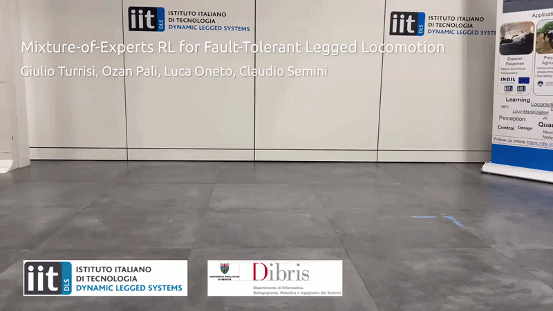

  
  
  
  

    
  

# fault-locomotion-isaaclab
An IsaacLab DirectEnv for quadrupedal locomotion under motor failures, with support for multiple quadruped robots, sim-to-sim, and sim-to-real pipelines.

Code will be released soon.

Real-world deployment via:
- [muse](https://github.com/iit-DLSLab/muse/tree/unitree_sdk) for state estimation (if no concurrent state estimation is used)
- [unitree-ros2-dls](https://github.com/iit-DLSLab/unitree-ros2-dls) for unitree robot communication

A list of robots and environments available is described below:

## Installation and Runs

If you want only to deploy a trained policy on your robot, continue on [README_DEPLOY](./README_DEPLOY.md) otherwise on [README_TRAIN](./README_TRAIN.md).

**For the train, check first the compatibility with IsaacLab and rsl-rl at the top of this readme. They indicate the releases that we tested.**